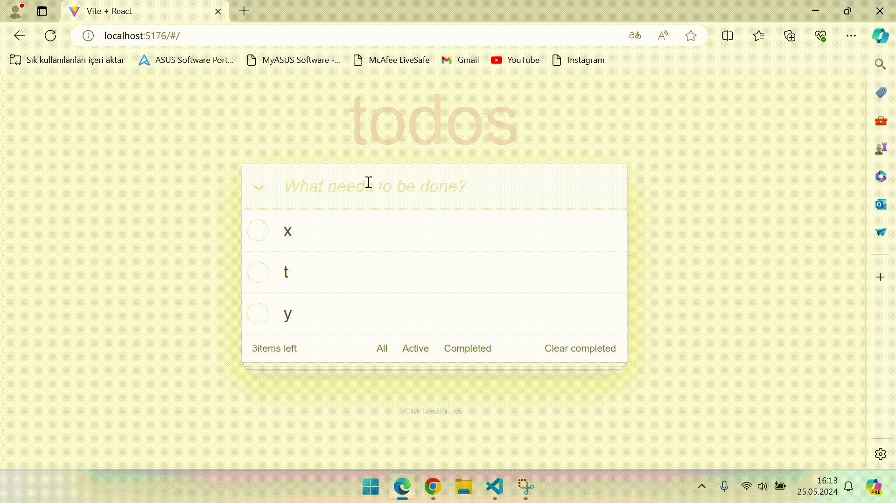

# Todo App

### TodoApp functions activated using react
### Todo App features:
#### Adding, deleting, updating Todo and marking as completed
#### Filtering todos using the buttons in the footer
#### React provider was used for project state management

### Short video of the project:
